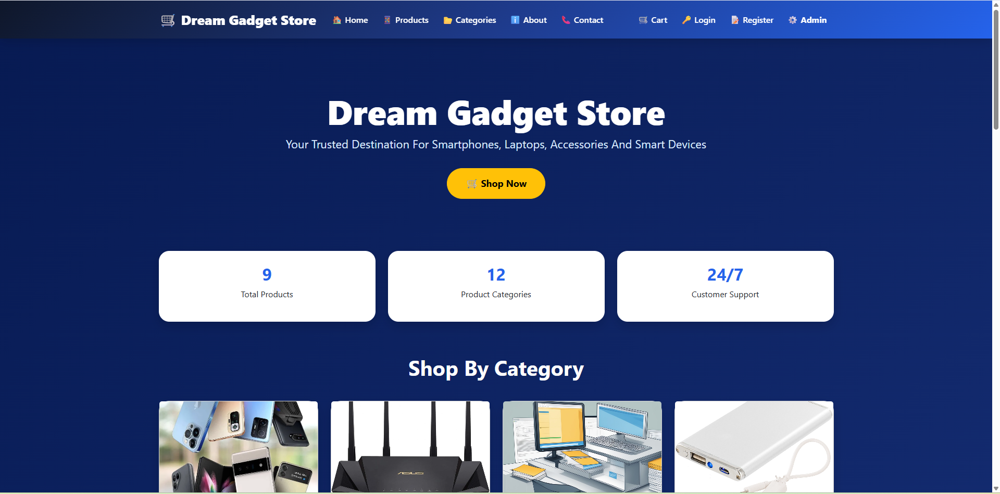
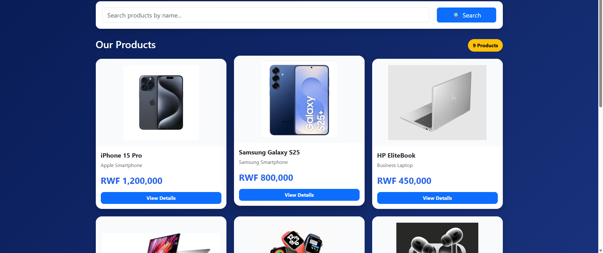
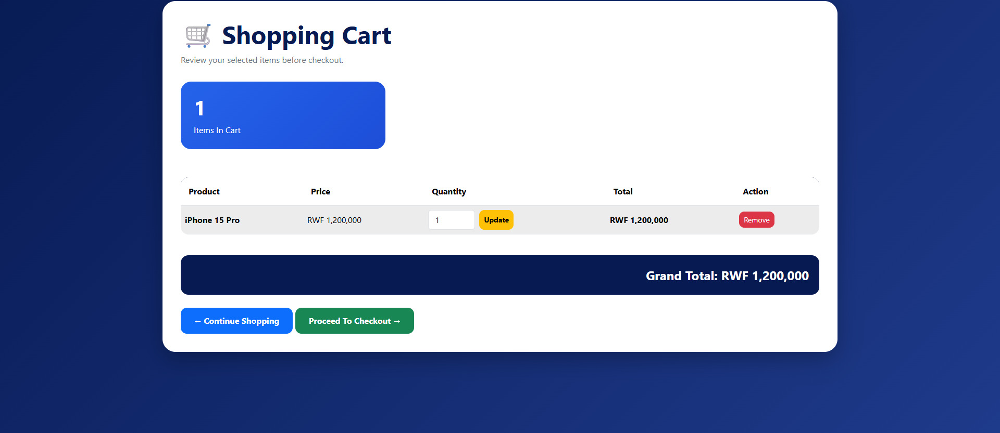
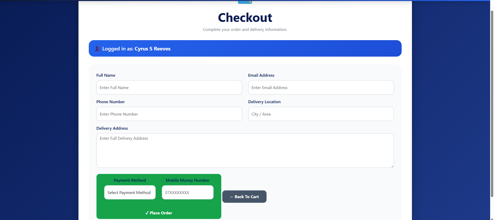
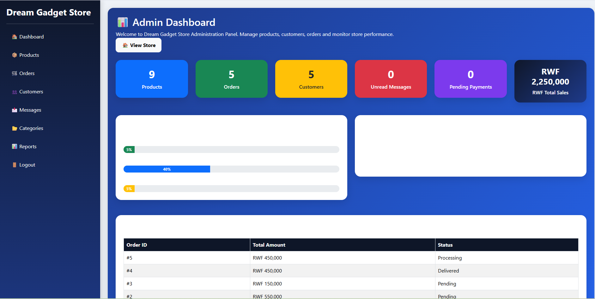
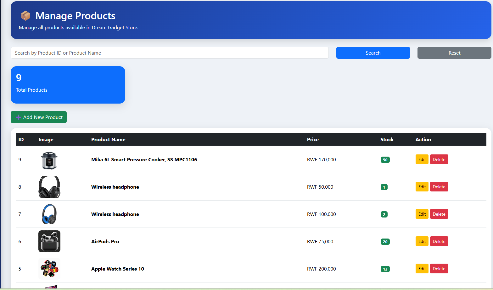
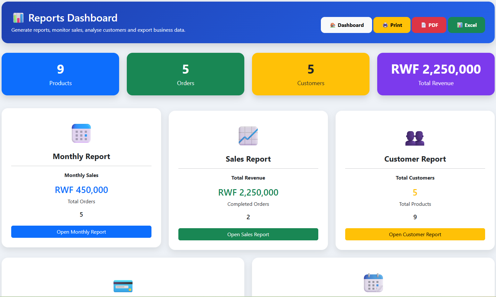
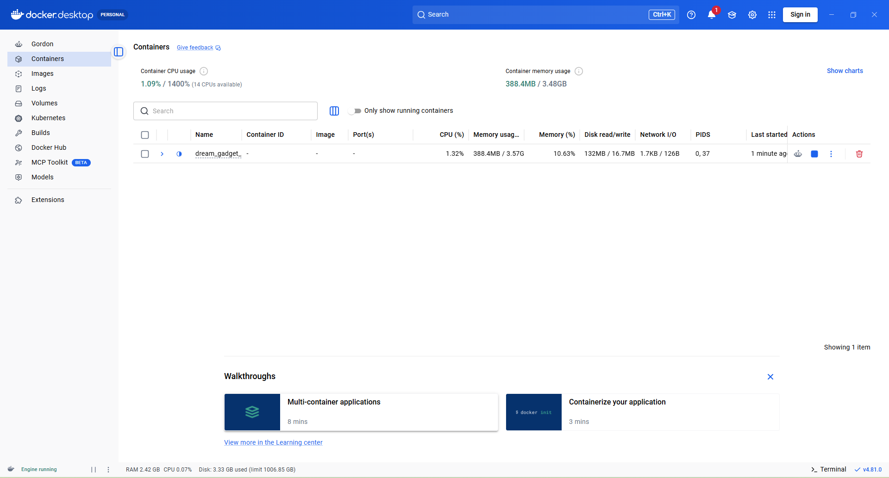

# 📱 Dream Gadget Store

E-Commerce Web Application Project Report

Student Name: Tongor Korden

Student ID:25253/2024

University: University of Lay Adventists of Kigali (UNILAK)

Programme: Bachelor of Science in Information Systems

Course: E-Commerce and Web Application

Lecturer: Eric Maniraguha

Academic Year: 2026

Introduction:
Dream Gadget Store is a modern web-based E-Commerce application developed to simplify the buying and selling of electronic products online. The system provides customers with a convenient shopping experience while allowing administrators to efficiently manage products, categories, customers, orders, and reports through an integrated administration dashboard.

The project was developed using PHP, MySQL, HTML5, CSS3, Bootstrap 5, and JavaScript. To follow modern software engineering practices, Git and GitHub were used for version control, Docker was used for application containerization, GitHub Actions implemented Continuous Integration (CI), and InfinityFree was used to deploy the application online.
A modern, responsive E-Commerce Web Application developed using **PHP, MySQL, Bootstrap 5, HTML5, CSS3, JavaScript, Docker, and GitHub Actions**.

Dream Gadget Store enables customers to browse electronic products, search products, manage shopping carts, place orders, and contact the store. The system also provides administrators with a professional dashboard to manage products, categories, customers, orders, reports, and business analytics.

---
Problem Statement

Many small businesses still rely on manual methods or outdated systems for managing products, customer information, and sales records. These methods often lead to inaccurate records, delayed customer service, and inefficient business operations.

The Dream Gadget Store system was developed to provide an online platform where customers can browse products, place orders, and manage their accounts while enabling administrators to efficiently manage business operations through a secure web application.
---
# 🌐 Live Demo

https://dreamgadgetstore.gt.tc/

---

# 📂 GitHub Repository

https://github.com/tongorkn-max/DreamGadgetStore1

---

# 📋 Project Objectives
The objectives of this project were to:

- Develop a responsive E-Commerce website.
- Allow customers to browse products by category.
- Implement customer registration and login.
- Provide shopping cart and checkout functionality.
- Enable administrators to manage products and categories.
- Generate business reports and sales analytics.
- Implement version control using Git and GitHub.
- Containerize the application using Docker.
- Implement Continuous Integration using GitHub Actions.
- Deploy the application online using InfinityFree.

---

# 🚀 Customer Features

- Home Page
- Product Catalog
- Product Categories
- Product Search
- Product Details
- Shopping Cart
- Checkout
- Customer Registration
- Customer Login
- Customer Dashboard
- Order History
- Contact Form
- Responsive Design

---

# 🔐 Administrator Features

- Secure Administrator Login
- Dashboard
- Product Management
- Category Management
- Customer Management
- Order Management
- Message Management
- Reports Dashboard
- Sales Reports
- Monthly Reports
- Customer Reports
- Business Analytics
- Print Reports
- Export Reports (PDF & Excel)
- Revenue Statistics
- Professional Responsive Admin Interface

---

# 📊 Reports Module

The reporting system includes:

- Sales Report
- Monthly Sales Report
- Customer Report
- Business Summary
- Print Report
- Export to PDF
- Export to Excel
- Revenue Analytics

---

# 🐳 Docker Containerization

The application is fully containerized using Docker.

Docker Components:

- Dockerfile
- Docker Compose
- PHP 8.2 Apache Container
- MySQL 8 Container
- Automatic Database Initialization
- Shared Volumes
- Container Networking

Run the project using:

```bash
docker compose up --build
```

Access the application:

```
http://localhost:8080
```

---

# 🔄 Continuous Integration (CI/CD)

GitHub Actions has been implemented for Continuous Integration.

The pipeline performs:

- Source Code Checkout
- PHP Environment Setup
- Dependency Installation
- Automated Build
- Automated Workflow Execution

Workflow file:

```
.github/workflows/php.yml
```

---

# 💻 Technologies Used

## Frontend

- HTML5
- CSS3
- Bootstrap 5
- JavaScript

## Backend

- PHP 8

## Database

- MySQL

## Local Development

- XAMPP

## Containerization

- Docker
- Docker Compose

## Version Control

- Git
- GitHub
- GitHub Actions

## Deployment

- InfinityFree

---

# 📁 Project Structure

```text
DreamGadgetStore1/

├── .github/
│   └── workflows/
│       └── php.yml
│
├── admin/
├── assets/
├── config/
├── docker/
│   └── init/
│
├── images/
├── uploads/
│
├── Dockerfile
├── docker-compose.yml
├── .dockerignore
├── README.md
├── index.php
└── ...
```

---

# ⚙️ Installation

## Clone Repository

```bash
git clone https://github.com/tongorkn-max/DreamGadgetStore1.git
```

---

## Database Setup (XAMPP)

1. Start Apache and MySQL.
2. Open phpMyAdmin.
3. Create a database:

```
dream_gadget_store1
```

4. Import:

```
if0_42269432_dream_gadget_store.sql
```

---

## Run Locally

Start:

- Apache
- MySQL

Visit:

```
http://localhost/Dream_gadget_store1
```

---

# 🐳 Run with Docker

Build and start the containers:

```bash
docker compose up --build
```

Visit:

```
http://localhost:8080
```

---

# 🔑 Administrator Login

**Username**

```
admin
```

**Password**

```
admin123
```

(Change according to your database if different.)

---

# 📷 Screenshots

## 🏠 Home Page



---

## 🛍️ Products Page



---

## 🛒 Shopping Cart



---

## 💳 Checkout



---

## 📊 Admin Dashboard



---

## 📦 Product Management



---

## 📈 Reports Dashboard



---

## 🐳 Docker Desktop



---

# 🔒 Security Features

- SQL Injection Prevention
- Session Authentication
- Input Validation
- Secure Administrator Access
- Password Protection
- Database Connection Validation

---

# 🔮 Future Improvements

- Online Payment Gateway
- Email Notifications
- SMS Notifications
- Product Reviews
- Wishlist
- Discount Coupons
- Multi-language Support
- Inventory Forecasting
- AI Product Recommendation
- REST API Integration
- Mobile Application
  
---
Challenges Encountere

Several challenges were experienced during development, including:

- Configuring Docker Desktop.
- Installing Windows Subsystem for Linux (WSL).
- Connecting Docker to MySQL.
- Managing Git merge conflicts.
- Configuring GitHub Actions.
- Deploying the application to InfinityFree.
- Managing database configuration for local, Docker, and online environments.

These challenges were resolved through testing, debugging, and configuration improvements.
---
Conclusion

The Dream Gadget Store project successfully demonstrates the development of a complete E-Commerce web application using modern web development technologies.

The system provides customers with an efficient online shopping platform while enabling administrators to manage products, customers, orders, and reports through a secure dashboard. The integration of GitHub, GitHub Actions, Docker, and InfinityFree demonstrates the application of modern software engineering practices, including version control, continuous integration, containerization, and deployment.

Overall, the project achieved its objectives and provides a scalable foundation for future enhancements and real-world business applications.
---
# 👨‍💻 Developer

**Tongor Korden**

Bachelor of Science in Information Systems

University of Lay Adventists of Kigali (UNILAK)

Kigali, Rwanda

---

# 📜 License

This project was developed for academic purposes at the University of Lay Adventists of Kigali (UNILAK).

© 2026 Tongor Korden. All Rights Reserved.
